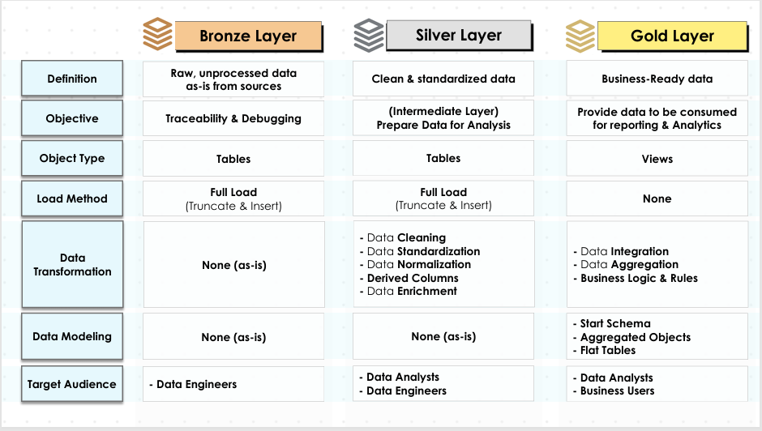
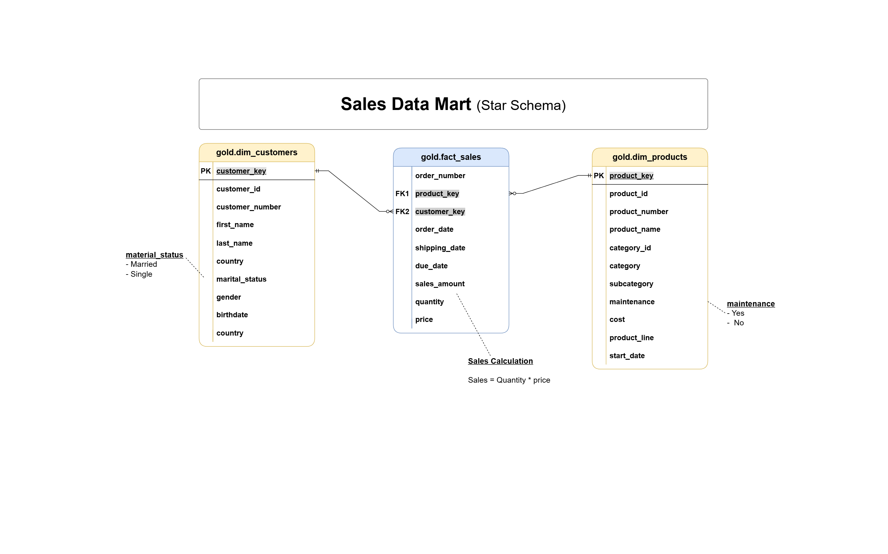

# Data Warehouse & Analytics Project

Welcome to the Data Warehouse & Analytics Project repository.

This project demonstrates the design and implementation of a modern SQL Server-based Data Warehouse using Medallion Architecture. The solution consolidates data from multiple business systems, applies data quality transformations, and delivers business-ready datasets optimized for reporting and analytical workloads.

---

## Project Overview

The project covers the complete data warehousing lifecycle:

* Data Ingestion from multiple source systems
* ETL Pipeline Development
* Data Cleansing and Standardization
* Data Integration and Transformation
* Dimensional Data Modeling
* Star Schema Design
* Data Quality Validation
* Documentation and Governance

The final output is a business-friendly analytical model designed to support reporting, dashboarding, and decision-making.

---

## Data Architecture

The solution follows a Medallion Architecture consisting of Bronze, Silver, and Gold layers.

### Bronze Layer

Stores raw data exactly as received from source systems.

Characteristics:

* Raw CRM and ERP data
* Full-load batch processing
* No transformations
* Tables used for storage

---

### Silver Layer

Prepares data for analytical use.

Transformations include:

* Data Cleansing
* Data Standardization
* Data Normalization
* Derived Columns
* Data Enrichment
* Validation Checks

Characteristics:

* Full-load batch processing
* Stored procedure driven loads
* Improved data quality

---

### Gold Layer

Provides business-ready datasets for reporting and analytics.

Characteristics:

* Star Schema Design
* Fact and Dimension Models
* Business Logic Implementation
* Reporting-ready Views

---

## Data Sources

The warehouse integrates data from two business systems.

### CRM

Contains:

* Customer Information
* Product Information
* Sales Transactions

### ERP

Contains:

* Customer Demographics
* Location Information
* Product Categories

Source data is provided as CSV files and loaded into SQL Server.

---

## ETL Process

### Extract

Data is extracted from source CSV files representing CRM and ERP systems.

### Transform

Data transformations include:

* Data Quality Validation
* Duplicate Removal
* Missing Value Handling
* Data Standardization
* Data Enrichment
* Business Rule Application

### Load

Data is loaded into Bronze and Silver layers through stored procedures using full-load processing.

Loading Strategy:

* Truncate and Load
* Batch Processing

---

## Data Model

The Gold Layer follows a Star Schema design optimized for analytical workloads.

### Dimension Tables

#### Dim Customers

Contains customer profile, demographic, and geographic information.

#### Dim Products

Contains product details, categories, and attributes.

### Fact Sales

Contains transactional sales metrics including:

* Orders
* Quantities
* Revenue
* Product Cost

The model is designed to support reporting, dashboarding, and analytical queries.

---

## Documentation

Project documentation includes:

* Data Architecture
* Data Flow Diagrams
* Data Integration Design
* Data Catalog
* Naming Conventions
* Data Model Documentation
* ETL Documentation

All supporting documentation can be found in the `docs` directory.

---

## Technologies Used

* Microsoft SQL Server
* SQL Server Management Studio (SSMS)
* SQL
* ETL
* Data Warehousing
* Star Schema
* Data Modeling
* GitHub

---

## Project Outcomes

Through this project I gained hands-on experience in:

* Designing Modern Data Warehouses
* Implementing Medallion Architecture
* Building SQL-based ETL Pipelines
* Applying Dimensional Modeling Techniques
* Creating Reporting-Ready Data Models
* Performing Data Quality Management
* Developing Analytical Data Structures
* Documenting Enterprise Data Solutions

---

## Author

Ramadugu Nagendra Chari

AI Engineer | LLM Training & Evaluation | Agentic Workflows | Analytics, Automation & Systems Thinking

LinkedIn: [Ramadugu Nagendra Chari](https://www.linkedin.com/in/ramadugu-nagendra-chari-60199b225/)

GitHub: [Ramadugu Nagendra Chari](https://github.com/NagendrachariRamadugu/)
